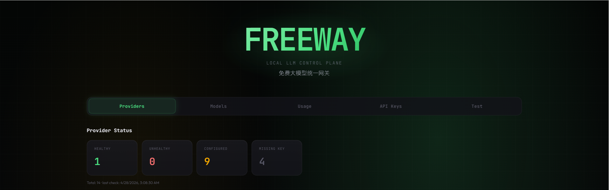

<p align="center">
  
</p>

<h1 align="center">Freeway</h1>

<p align="center">
  A local multi-provider LLM gateway with OpenAI-compatible and Anthropic-compatible APIs,
  a built-in web console, provider health checks, dynamic model sync, and runtime key management.
</p>

<p align="center">
  <a href="./README.zh-CN.md">简体中文</a> ·
  <a href="./CONTRIBUTING.md">Contributing (EN)</a> ·
  <a href="./contribution.md">贡献指南 (中文)</a>
</p>

<p align="center">
  <strong>One local endpoint.</strong>
  <strong>Many free-capable providers.</strong>
  <strong>One operational console.</strong>
</p>

## Why Freeway

Freeway lets you put a single local gateway in front of multiple free or low-friction LLM providers and expose them through a cleaner, more predictable API surface.

It is designed for day-to-day use with coding agents, scripts, local tools, and experimentation workflows where you want:

- one base URL instead of switching provider endpoints
- one place to manage provider keys and health status
- OpenAI-compatible chat completions and model listing
- Anthropic-compatible messages bridging
- a local control panel for routing, testing, and observability

## Highlights

- **Unified local gateway**
  - Serve multiple providers behind one local service at `http://localhost:8787`.
  - Route by canonical model name or force a provider with `provider/model` syntax.

- **OpenAI + Anthropic compatibility**
  - OpenAI-compatible endpoints: `/v1/chat/completions`, `/v1/models`
  - Anthropic-compatible endpoint: `/v1/messages`
  - Anthropic requests are bridged into OpenAI-style requests internally.

- **Usage normalization at the gateway layer**
  - Non-stream OpenAI-compatible responses return stable `usage` fields.
  - Non-stream Anthropic-compatible responses return stable `usage.input_tokens` / `usage.output_tokens`.
  - Anthropic streaming avoids misleading placeholder zero-usage payloads.

- **Built-in web console**
  - Browse providers and models
  - Check provider health and latency
  - Configure runtime API keys
  - Refresh model catalogs
  - Test requests locally

- **Operationally practical defaults**
  - Cached model lists on boot
  - Background model refresh
  - Local key persistence
  - Optional gateway auth via `FREEWAY_API_KEY`
  - Optional outbound proxy via `HTTP_PROXY`

## Supported Providers

Currently wired through `src/providers/index.ts`:

`openrouter`, `groq`, `github`, `cloudflare`, `siliconflow`, `cerebras`, `mistral`, `cohere`, `nvidia`, `llm7`, `kilo`, `zhipu`, `opencode`

## Quick Start

### 1. Prerequisites

- Node.js 18+
- npm

### 2. Install and launch

```bash
npm install
npm run build
npm start
```

Default server address:

- `http://localhost:8787`

### 3. Open the console

Visit:

- `http://localhost:8787/`

Then configure provider keys in the **API Keys** tab, or provide them with environment variables.

## Configuration

### API key precedence

Effective key precedence is:

1. Runtime key set via UI/API
2. Environment variable
3. Persisted `.freeway/config.json`

### Common environment variables

| Variable | Purpose |
|---|---|
| `FREEWAY_API_KEY` | Optional gateway auth key for clients calling Freeway |
| `OPENROUTER_API_KEY` | OpenRouter key |
| `GROQ_API_KEY` | Groq key |
| `GITHUB_TOKEN` | GitHub Models token |
| `CLOUDFLARE_API_KEY` | Cloudflare API key |
| `CLOUDFLARE_ACCOUNT_ID` | Required for Cloudflare model sync |
| `SILICONFLOW_API_KEY` | SiliconFlow key |
| `CEREBRAS_API_KEY` | Cerebras key |
| `MISTRAL_API_KEY` | Mistral key |
| `COHERE_API_KEY` | Cohere key |
| `NVIDIA_API_KEY` | NVIDIA NIM key |
| `LLM7_API_KEY` | LLM7 key |
| `KILO_API_KEY` | Kilo key |
| `ZHIPU_API_KEY` | Zhipu / BigModel key |
| `OPENCODE_API_KEY` | OpenCode key |
| `HTTP_PROXY` | Optional global HTTP proxy for outbound provider calls |

## API Examples

### OpenAI-compatible chat completion

```bash
curl http://localhost:8787/v1/chat/completions \
  -H "Content-Type: application/json" \
  -H "Authorization: Bearer $FREEWAY_API_KEY" \
  -d '{
    "model": "llama-3.3-70b",
    "messages": [{"role": "user", "content": "Say hello from Freeway"}],
    "stream": false
  }'
```

### Force a provider explicitly

```json
{
  "model": "groq/llama-3.3-70b"
}
```

### Anthropic-compatible messages request

```bash
curl http://localhost:8787/v1/messages \
  -H "Content-Type: application/json" \
  -H "Authorization: Bearer $FREEWAY_API_KEY" \
  -d '{
    "model": "llama-3.3-70b",
    "max_tokens": 256,
    "messages": [{"role": "user", "content": "Hello"}]
  }'
```

### Claude-style local base URL usage

For Anthropic-compatible clients that let you override the base URL, point them at:

- `http://localhost:8787`

Freeway serves the compatibility routes under that origin.

## HTTP Endpoints

| Method | Path | Description |
|---|---|---|
| `GET` | `/` | Web console |
| `GET` | `/health` | Service health |
| `GET` | `/api/catalog` | Provider / model / health summary |
| `POST` | `/api/health/check/:provider` | Check one provider |
| `POST` | `/api/health/check-all` | Check all providers |
| `POST` | `/api/models/refresh` | Refresh provider model lists |
| `POST` | `/api/config/keys` | Save runtime / persisted keys |
| `GET` | `/v1/models` | OpenAI-compatible models list |
| `POST` | `/v1/chat/completions` | OpenAI-compatible chat completions |
| `POST` | `/v1/messages` | Anthropic-compatible messages |

## Project Structure

```text
src/
  index.ts                # Entry point
  server.ts               # HTTP server + routes + static hosting
  router.ts               # Provider routing and retry logic
  providers/              # Provider definitions and model sync orchestration
  models/                 # Canonical model registry + sync/cache adapters
  web/                    # Console UI (HTML/CSS/JS)
  config*.ts              # Runtime + persisted key config
  health.ts               # Provider health checks and summary
  anthropic-bridge.ts     # Anthropic <-> OpenAI request/response bridge
  usage.ts                # Gateway-level usage normalization helpers
```

## Development

```bash
npm run dev
npm run build
npm start
npm run test:usage
```

## Contributing

- English: [CONTRIBUTING.md](./CONTRIBUTING.md)
- 中文： [contribution.md](./contribution.md)

## License

MIT
